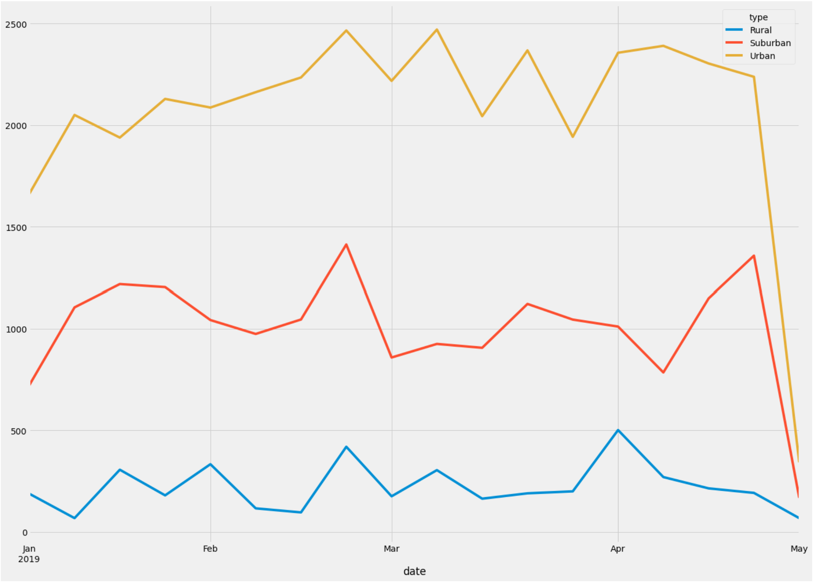

# PyBer_Analysis
## Project Overview 
The purpose of the analysis is to use the outcomes to improve access of ride-sharing services for underserved neighborhoods. Also, the analysis can help determine the affordability for those neighborhoods. Different sets of data were used to get the total number of drivers, total number of rides, total number of drivers, etc. By using the data mentioned, the team is able to determine which city types have the highest average fares and rides. 

## Results
Results: Using images from the summary DataFrame and multiple-line chart, describe the differences in ride-sharing data among the different city types.
Based on the results from the analysis, the urban city type have the highest fare throughout the months followed by suburban and rural. We can see an uptick on the average fare amount during end of February and during March. 

## Challenge Summary 
Based on the results, the recommendations for addressing any disparities among the city types are: 
1. Attract more drivers in rural areas. Based on the data, drivers in rural areas have the highest average per ride. 
2. Decrease the price of rides on rural areas. Rural areas have the highest average per ride but they have the lowest amount of rides per month. By decreasing the price, more people will be taking ride-sharing services. 
3. The low cost in urban areas might be because the distances are shorter than in rural and suburban areas. 

